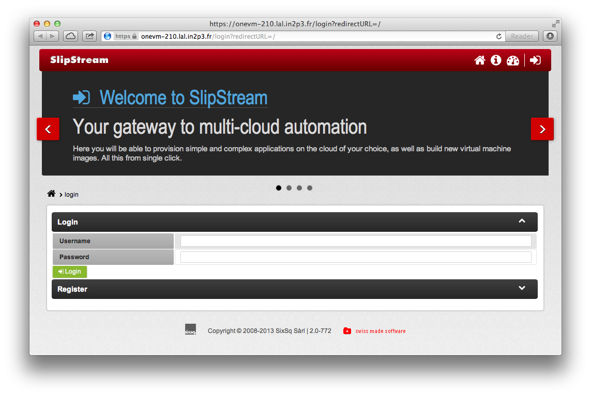

# Installation

Once the packages are available, installing the SlipStream™ server is
as simple as installing a package with `yum`.  After the installation,
the services can be started via standard SysV initialization scripts.

## Yum repository configuration

The yum installer needs to be told where to find the packages. For this
create the following files:

Note: please replace *<slipstream-yum-repository>* with a value provided
by SixSq or from the yum repository you will have created.

    $ cat > /etc/yum.repos.d/slipstream.repo <<EOF
    [SlipStream-releases]
    name=SlipStream-releases
    baseurl=<slipstream-yum-repository>
    gpgcheck=0
    enabled=1
    EOF

The current version of the SlipStream™ server package depends on
the StratusLab client.  You therefore need to also tell yum where to find
the StratusLab packages.  This can be done by creating the following yum
repo file:

    $ cat > /etc/yum.repos.d/stratuslab.repo <<EOF
    [StratusLab-Releases]
    name=StratusLab-Releases
    baseurl=http://yum.stratuslab.eu/releases/centos-6
    gpgcheck=0
    enabled=1
    EOF

You must also configure the machine for the [EPEL 6 repository][epel].
The instructions for doing this can be found in the build chapter.

Once these are in place it is a good idea to clear the cache and
update your system with:

    $ yum clean all
    $ yum update

## Install Packages

Once the yum system is setup, just install the package for the
SlipStream™ server; it will pull in all of the necessary dependencies
including the database.

    $ yum install slipstream-server

The software will be installed in the `/opt/slipstream` directory and
the configuration files will be in `/etc/slipstream`.

## SSH public/private keys

The SlipStream™ server uses SSH for secure communication between the
orchestrator and user virtual machines. By default these are the root
private (`$HOME/.ssh/id_rsa`) and public (`$HOME/.ssh/id_rsa.pub`)
keys.  Ensure that these exist, or better, generate a separate key
pair for use with SlipStream.

To generate a new key pair, use the command:

    $ ssh-keygen

The parameters to indicate the key pair to use are found in the
*SlipStream Advanced* configuration section of the web interface.

## Start Database

After this start the database:

    $ service hsqldb start

The database files will be stored eventually in
`/opt/slipstream/SlipStreamDB/`.

**NOTE: The startup script will indicate that the start failed, but
the database is indeed running correctly.**

## Start SlipStream

Next start SlipStream™.

    $ service slipstream start

The server will automatically populate the empty database when the
service initizes. 

You should now be able to contact the SlipStream™ server with a web
browser using HTTPS.  Note that the service will initially use a
self-signed certificate, so you may be warned by your browser about
this.

You should be redirected to the login page that looks similar to
the following screenshot.  If so, you are ready to configure the
server.

