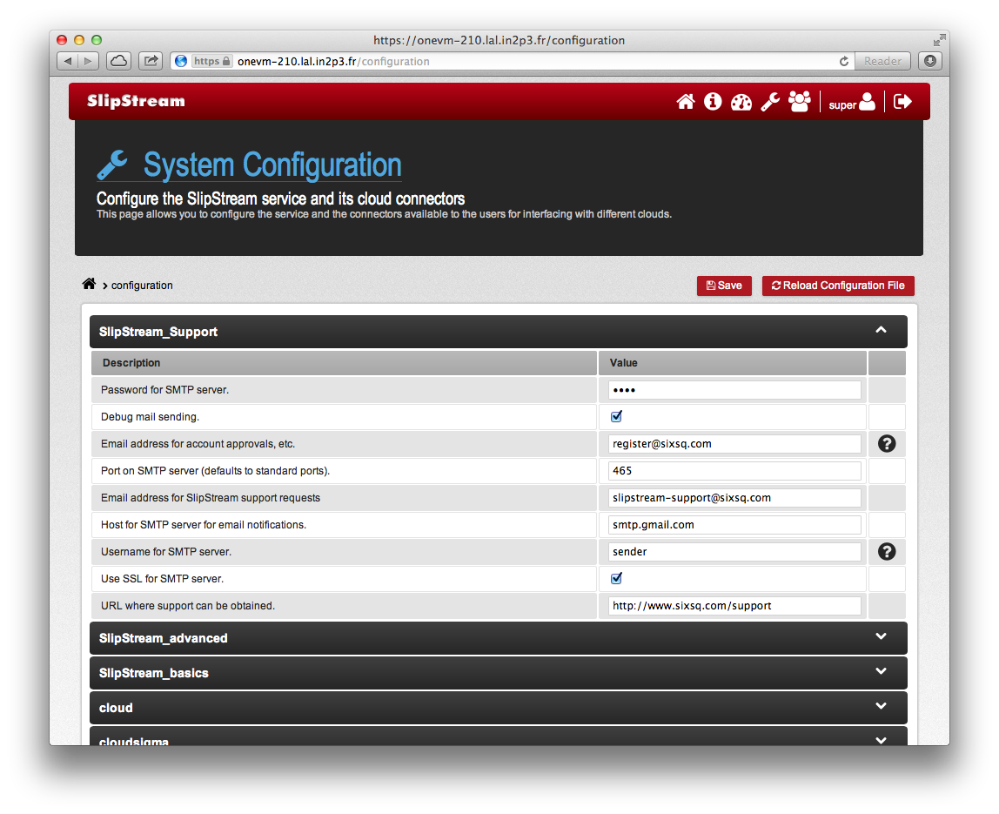

# Configuration

Now that you have successfully started the SlipStream server, you will
need to configure it.  Most of this configuration can be done through
the web interface.

## Predefined Accounts

The following table describes the predefined accounts for a new
SlipStream™ installation.

-----------------------------------------------------------------
User  Password   Description
-----------------------------------------------------------------
super supeRsupeR The initial administrator account for the 
                 service.  This account can modify the server 
                 configuration and all modules.

sixsq sixsQsixsQ Owner of pre-defined images and tutorials that
                 are "public" and available to all authenticated
                 users.

test  test       A test account with no elevated privileges.
-----------------------------------------------------------------

**The passwords for these accounts should be changed immediately.** To
do so log into the server with the "super" account.  After logging in,
click on the "users" icon to see a list of users.  You should see a
list of users like the following screenshot.

Click on the username, then on the "edit" button.  Fill in the new
password (twice) and click "save".  The password will be updated.  Do
this for all three accounts.  Note: For the "super" account you will
have to provide the current password.

## SSL Certificate

Sensitive credentials are passed between a user's browser and the
SlipStream™ server; consequently, the server must be configured to use
SSL. The metadata describing machines and deployments may also contain
proprietary information and be similarly sensitive.

The server will initially start with a self-signed certificate that is
included in the package.  You should either create a self-signed
certificate for your host or better (and strongly recommended) use a
commercial certificate signed by a well-known certificate authority.

### Using a Commercial Certificate

A commercial certificate signed by a well-known certificate authority is
the easiest to configure. These certificates are trusted by default in
most browsers and by most java distributions. Follow the instructions of
your chosen provider to obtain a signed certificate. Usually, this
certificate is delivered in X509 form (`*.pem` file). To use this for
the SlipStream™ server it must be converted either to PKCS12 for JKS
format.

To convert, the certificate and key into a PKCS12 format do the
following:

    openssl pkcs12 -in name.crt -inkey name.key -o name.p12

The resulting file will contain both the certificate and key. Be sure to
remember the password used to secure the PKCS12 file.

To convert, to JKS (Java Key Store) format, do the following:

    keytool -cert name.crt -key name.key

The resulting file will contain both the certificate and key. Be sure to
remember the password used to secure the JKS file.

The resulting keystore must be saved in the file
`/opt/slipstream/etc/jetty.jks`.  You must provide the password in the
file `/opt/slipstream/etc/jetty-ssl-slipstream.xml`.

After updating the certificate and configuration, restart the
SlipStream™ server.

### Using a Self-signed Certificate

The advantage of a self-signed certificate is that it can be created
with no cost. The disadvantage is that it is not trusted by default by
web browsers nor by the java distributions. The SlipStream™ server and
client can be configured to trust the self-signed certificate. Web
browsers will generally warn users that the certificate is not trusted,
but give the user the option to ignore the warning.

Follow the instructions found on the web to create a self-signed
certificate.  Then use the same procedure to install this for the
SlipStream™ server. 

## Support Configuration

The SlipStream often needs to send out email notifications, especially
when validating email addresses during user registration.  These
parameters are set in the "SlipStream_Support" pane of the server
configuration. 

To set these parameters click on the "wrench" icon at the top of the
page.  You should see a configuration page like the following.  Fill
in the fields with the correct information and click on the "save"
button. 

### Cloud Configuration

On the configuration page, there is one pane for each supported
cloud.  If the type of cloud you want to use isn't listed, then you
will have to import the plugin for that cloud.

See the documentation for each plugin for help on configuring the
parameters. 

