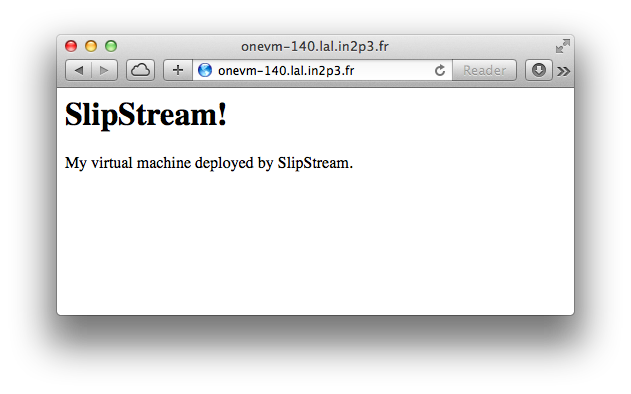

# End Users

End-users will likely use SlipStream™ as a **resource provisioning
engine** to deploy predefined virtual machines and full services, such
as batch clusters.

## Run a Virtual Machine

At its simplest, SlipStream™ can be used to launch individual virtual
machines.  To show how this is done, navigate to the
"Public/BaseImages" module.  You will see a set of minimal images that
can be used directly or as part of a coordinated deployment.

Descend into the "Ubuntu/12.04" module where you should see a
screenshot like the following.

The sections provide various information about the image itself.  In
this case this is a simple reference image for StratusLab clouds.  You
can see this in the "Cloud Image Identifiers..." section.

To run an instance of this machine, click on the "Run" button.  This
will redirect you to a page showing the status of the deployment.
This page is actively updated, so that you can see when the machine is
available.

To see the status of the virtual machine, just hover over the box
representing the virtual machine.  Once it is in the "Running" state
on the cloud, it can be accessed directly via SSH:

    $ ssh root@134.158.75.159
    Welcome to Ubuntu 12.04 LTS (GNU/Linux 3.2.0-24-generic x86_64)
    ...
    $

From here, you can do install and configure any services that you
would like.  For example, let's install a web server by hand and show
that it works. 

To install the web server, just install one via the `apt-get`
command. 

    $ apt-get install apache2
    ...
    Unpacking apache2 (from .../apache2_2.2.22-1ubuntu1_amd64.deb) ...
    ...
    Setting up apache2-mpm-worker (2.2.22-1ubuntu1) ...
     * Starting web server apache2
    Setting up apache2 (2.2.22-1ubuntu1) ...
    Setting up ssl-cert (1.0.28) ...
    Processing triggers for libc-bin ...
    ldconfig deferred processing now taking place
    $ 

Then provide a customized front page and start the server.

    $ cat > /var/www/index.html <<EOF
    <html><body><h1>SlipStream!</h1>
    
My virtual machine deployed by SlipStream.

    </body></html>
    EOF

You can then view the page via a web browser and verify that the
server is running and serves up the correct file.

You can stop the machine directly through the SlipStream™ interface.
On the run page, just click on the "Terminate" button.  This will
shutdown the virtual machine and release the associated resources.

## Deploy a Cluster

While it is interesting to use SlipStream™ to deploy virtual machines,
especially when dealing with multiple cloud infrastructures, it is
even more appealing to deploy complete computing platforms.

Scientific computing often requires the deployment of a dedicated
batch cluster for scientific data analysis.  Procuring the necessary
hardware, initializing the machines, and configuring a batch system
can be a long and time-consuming process.  With SlipStream™ and the
cloud, this can be done quickly and easily. 

One of the predefined deployments is a Torque cluster.  The deployment
consists of a head node and a collection of worker nodes.  Typically,
the user will submit jobs to the head node which will then be
dispatched to and run by a worker node.

Let's start a cluster and verify that it works.  Navigate to the
"Public/Tutorials/Cluster" module. 

**TO BE COMPLETED...**

