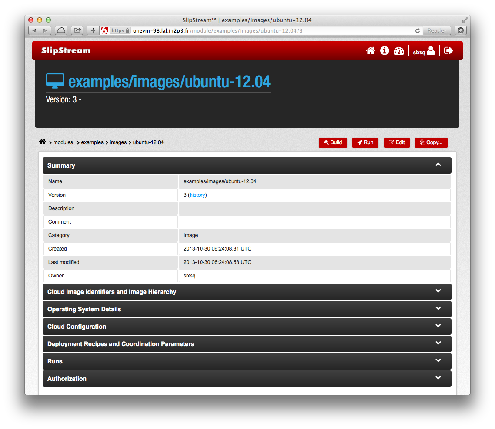
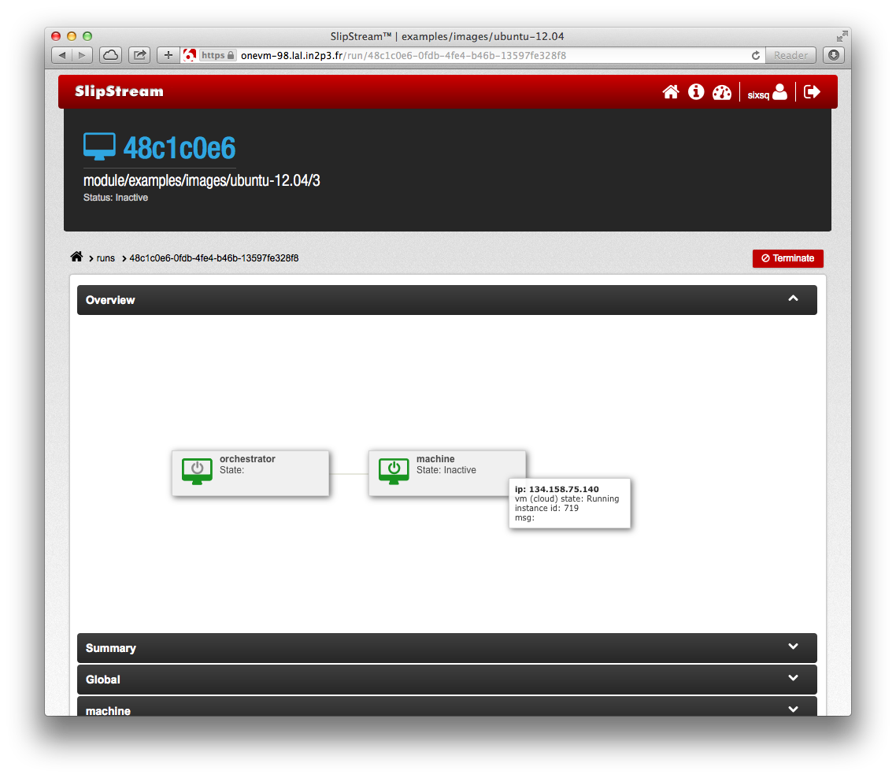
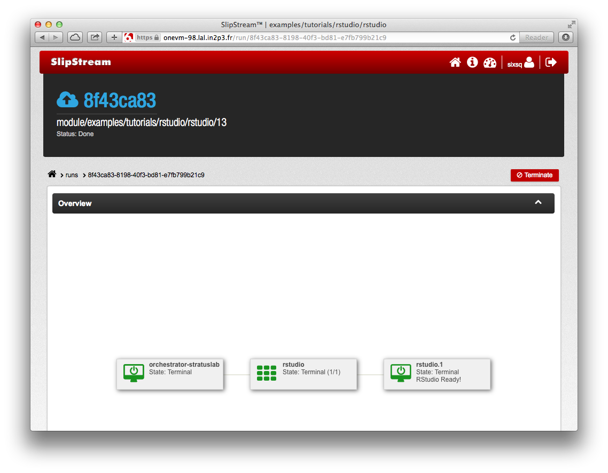
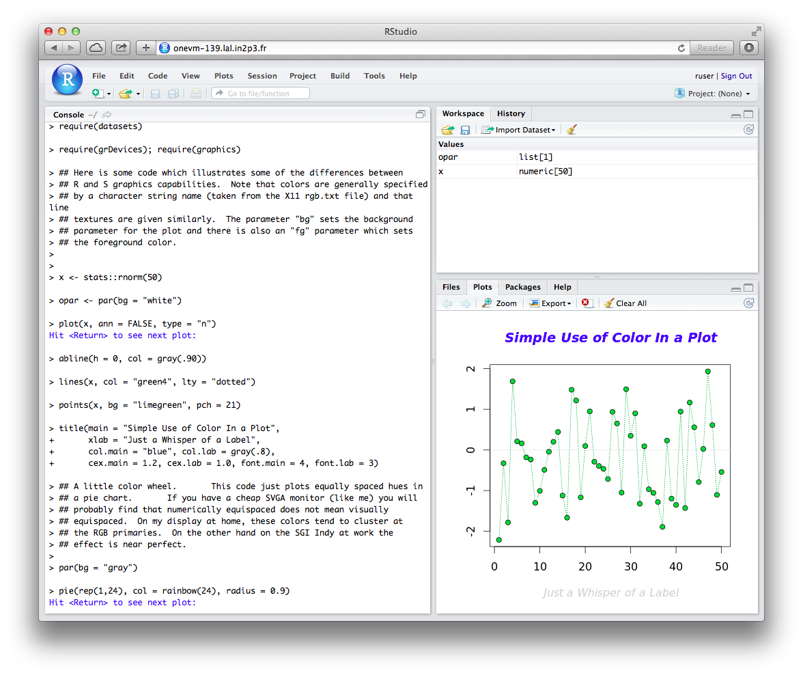

# End Users

End-users will likely use SlipStream™ as a **resource provisioning
engine** to deploy predefined virtual machines and full services, such
as batch clusters.

## Run a Virtual Machine

At its simplest, SlipStream™ can be used to launch individual virtual
machines.  To show how this is done, navigate to the
"examples/images" module.  You will see a set of minimal images that
can be used directly or as part of a coordinated deployment.

Clicking on the "ubuntu-12.04" module, you should see a screenshot
like the following.

The sections provide various information about the image itself.  In
this case this is a simple reference image for StratusLab clouds.  You
can see this in the "Cloud Image Identifiers..." section.

To run an instance of this machine, click on the "Run" button.  This
will redirect you to a page showing the status of the deployment.
This page is actively updated, so that you can see when the machine is
available.

To see the status of the virtual machine, just hover over the box
representing the virtual machine.  Once it is in the "Running" state
on the cloud, it can be accessed directly via SSH:

    $ ssh root@134.158.75.140
    Welcome to Ubuntu 12.04 LTS (GNU/Linux 3.2.0-24-generic x86_64)
    ...
    $

From here, you can install and configure any services that you would
like.  For example, let's install a web server by hand and show that
it works.

To install the web server, just install one via the `apt-get`
command. 

    $ apt-get update
    Get:1 http://security.ubuntu.com precise-security Release.gpg [198 B]
    ...

    $ apt-get -y install apache2
    ...
    Unpacking apache2 (from .../apache2_2.2.22-1ubuntu1_amd64.deb) ...
    ...
    Setting up apache2-mpm-worker (2.2.22-1ubuntu1) ...
     * Starting web server apache2
    Setting up apache2 (2.2.22-1ubuntu1) ...
    Setting up ssl-cert (1.0.28) ...
    Processing triggers for libc-bin ...
    ldconfig deferred processing now taking place
    $ 

Then provide a customized front page and start the server.

    $ cat > /var/www/index.html <<EOF
    <html><body><h1>SlipStream!</h1>
    
My virtual machine deployed by SlipStream.

    </body></html>
    EOF

You can then view the page via a web browser and verify that the
server is running and serves up the correct file.

You can stop the machine directly through the SlipStream™ interface.
On the run page, just click on the "Terminate" button.  This will
shutdown the virtual machine and release the associated resources.

**Warning**: The image creation, package, and deployment recipes are
**not invoked** when starting an image in this way.  This type of
deployment is only useful for getting quick access to a machine for
interactive testing.

## Run an R Analysis Server

Advanced users and administrators can define appliances and services
that can be easily deployed by others.  One example is an RStudio
deployment that creates an R analysis server with a web browser
interface.  More information about RStudio can be found on their [web
site][rstudio].

Within SlipStream™, navigate to the "examples/tutorials/rstudio"
module.  This module launches the predefined "rstudio-appliance" and
runs the deployment script to configure the machine.  The software
uses the user accounts defined on the machine for accessing the
server.  To remain secure, the deployment dynamically creates a user
account with a random password when the machine is deployed.  The
username and password are communicated to the user through the
SlipStream™ interface.

From the deployment module, click on the "Run" button to start.  This
will start an "orchestrator" to manage the deployment. The
orchestrator will then deploy the RStudio server.  You will see the
progress of the deployment in the "Run" dashboard for the deployment.
Once the server has been fully deployed, the message in the deployment
should change to "RStudio Server Ready!".

At this point, you can access the server via a web browser.  You can
find the address for the machine by hovering over the RStudio
deployment box.  You will be greeted by a login page requiring a
username and password.

You can find the credentials to use in the published deployment
parameters.  Open the accordian section titled "rstudio.1"; these are
the parameters tied to the RStudio server.  In these parameters, there
are two ("rstudio_user" and "rstudio_pswd") that provide the
necessary credentials.  Take a look at the following screenshot.

Use those credentials to log into the RStudio web interface and you
should see the RStudio interface.  You can now use the deployed
machine for doing R analyses or just to play around.  Try out the
graphics demo by typing "demo(graphics)" at the console!

To terminate the machine, you can just click the "Terminate" button in
the SlipStream™ interface.  Remember to save any information or data
you created outside of the machine before terminating it.

## Deploy a Cluster

While it is interesting to use SlipStream™ to deploy virtual machines
and appliances, especially when dealing with multiple cloud
infrastructures, it is even more appealing to deploy complete
computing platforms.

Scientific computing often requires the deployment of a dedicated
batch cluster for scientific data analysis.  Procuring the necessary
hardware, initializing the machines, and configuring a batch system
can be a long and time-consuming process.  With SlipStream™ and the
cloud, this can be done quickly and easily. 

Numerous different software distributions exist for implementing a
batch cluster.  Nonetheless, they all work similarly.  The cluster
deployment consists of a master and a collection of worker nodes.
Typically, the user will submit jobs to the master.  Those jobs will
then be dispatched to and run by a worker node, with the results sent
back to the master.

The tutorials contain an example cluster deployment based on Torque.
More information on Torque can be found on [their website][torque].
Let's start a cluster and verify that it works.  Navigate to the
"examples/tutorials/torque" module.  This contains image definitions
for the Torque master and worker.  The "torque" deployment module
defines the system configuration which by default contains two workers
and one server.

In the "torque" deployment module, click on the "Run" button to deploy
a cluster with the default configuration.  Once the deployment has
completed the setup, you will be able to log into the master node as
the user "tuser".  (Look for the "master.1:hostname" property in the
"master.1" section for the hostname or IP address.)

    $ ssh tuser@134.158.75.190

The deployment will have created the "tuser" account and configured it
so that you can log in with your standard SSH key.  Once logged in,
you can verify that cluster is correctly configured.

> **NOTE**: To use Torque to submit jobs, you must be logged in as a
> **non-root** user.  Be sure to log in as "tuser" to follow the rest
> of this example.

Use the command `pbsnodes` to see the state of all of the workers.  

    $ pbsnodes -a

    onevm-188.lal.in2p3.fr
         state = free
         np = 1
         ntype = cluster
         status = rectime=1384596949,varattr=,jobs=...

    onevm-189.lal.in2p3.fr
         state = free
         np = 1
         ntype = cluster
         status = rectime=1384596950,varattr=,jobs=...

You will see that two worker nodes are available and free.  (The
status lines have been truncated.)  The master node is not configured
to run jobs and will not appear in the list.

To test that the cluster works correctly, create a job script
(`job.sh`) with contents like the following:

    #!/bin/bash
    hostname -f
    date
    sleep 20
    date

Then launch a number of these jobs and follow their progress on the
cluster. 

    $ for i in {1..20}; do qsub job.sh; done
    
    $ qstat

    0.onevm-190 job.sh tuser   00:00:00 C batch          
    1.onevm-190 job.sh tuser   00:00:00 C batch          
    2.onevm-190 job.sh tuser   00:00:00 C batch          
    3.onevm-190 job.sh tuser   00:00:00 C batch          
    4.onevm-190 job.sh tuser   00:00:00 C batch          
    5.onevm-190 job.sh tuser   00:00:00 C batch          
    6.onevm-190 job.sh tuser          0 R batch          
    7.onevm-190 job.sh tuser          0 R batch          
    8.onevm-190 job.sh tuser          0 Q batch          
    9.onevm-190 job.sh tuser          0 Q batch
    ...

You should see the jobs gradually advance from queued, to running, and
then to the completed state.  As the jobs complete, you should see
files containing the stderr and stdout of the job in your directory.
The stderr files should be empty and the stdout files should contain
the hostname and two dates. 

    $ cat job.sh.o9
    onevm-189.lal.in2p3.fr
    Sat Nov 16 10:20:33 UTC 2013
    Sat Nov 16 10:20:53 UTC 2013

If you look at all of the output files, you should see that jobs are
being run on both of the worker nodes.

As usual, the full cluster can be torn down by clicking on the
"Terminate" button.  Save any results you want to keep outside of the
deployment before shutting down the cluster.

[rstudio]: http://www.rstudio.com
[torque]: http://www.adaptivecomputing.com/products/open-source/torque/
