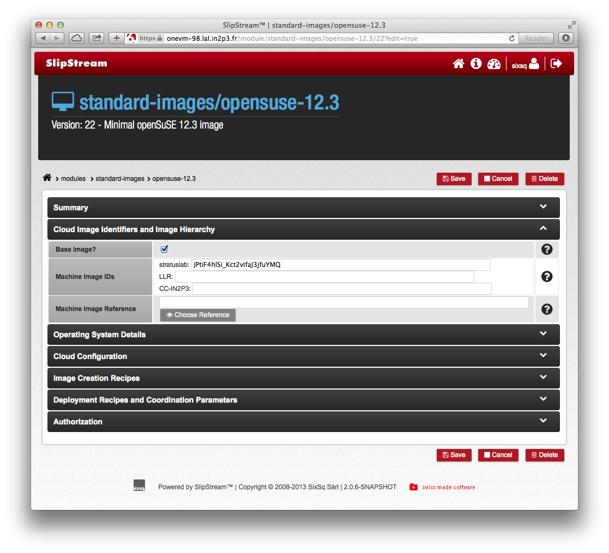

# Service Providers

SlipStream™ to define customized images and full systems (batch
clusters, LAMP applications, analysis platforms, etc.), creating a
**rich catalog of services** that end-users can deploy with the click
of a button.  Service providers take advantage of this to create and
to maintain platforms for their users.

## Define Machines

One of the most powerful features of cloud technology is the ability
to provide fully customized, reproducible computing environments.
SlipStream™ allows its users to take advantage of this, while keeping
track of the knowledge required to build those images and to
understand their contents.

### Reference Images

Unfortunately, it is next to impossible to create images that can be
easily and reliably run on all of the popular cloud platforms.
Because of this SlipStream™ references minimal images within each cloud
platform to use as starting points for more complex, customized
images.

As you saw previously, SlipStream™ provides a number of these in the
"Public/BaseImages" module.  However, service providers will often
want to make a larger set of images available.

The SlipStream connectors will bootstrap the image through the
contextualization process.  The lightweight bootstrap script does
however require that `wget` and `python` v2.6+ be available.  This is
the case for the majority of cases.

For StratusLab, all of the standard images already have these
dependencies, so it is easy to use those images through SlipStream.
The procedure is:

1. In your home area, create a new project ("New Project" button) to
hold your images.  Provide an appropriate name for the project and
save it.

2. Within the project (which should be open now), click on the "New
Machine Image" button.  Provide an appropriate name and description.

3. Before saving this, open the "Cloud Image Identifiers..." section.
You then can click on the "Base image?" checkbox and provide the
StratusLab Marketplace identifier for the image (see screenshot).

4. Now save the image.

This image can now be used through SlipStream like any other.  You can
launch an instance of it directly or include it in a deployment.  Note
that for base images, you can also provide deployment recipes and
coordination parameters.

### Creating New Images

Once an appropriate reference image is available for a cloud
infrastructure, SlipStream™ can automate the generation of further
customized images.  The idea behind the image creation is simple:

1. Add a list of new packages to the machine.
2. Run a script defined by the user to configure the machine.

Once these are defined, SlipStream™ automates the creation of an
image.

As an example we will create a new machine image that has WordPress
installed and configured.  Starting the image, will automatically
start WordPress.  We will also show how parameters can be passed from
SlipStream™ to the machine.

**TO BE COMPLETED...**

## Defining Systems

While being able to customize individual machines is powerful, most
real world systems consist of multiple machines.  This is often
required because of very different resource requirements for the
different components in the system and to be able to support scaling
the system in response to changes in demand.

To demonstrate the abilities of SlipStream™ in this area, we will
define and deploy a simple LAMP (Linux, Apache, MySQL, PHP)
application.

### Coordinated Startup

Once services in a system are distributed over a set of machines,
coordination of the various services becomes an issue.  In this case,
we want to ensure that the MySQL database will be up and ready before
allowing users to access the PHP frontend.

The SlipStream™ client provides a way to pass parameters between the
various nodes, allowing for example, the PHP frontend to discover the
location of the MySQL database.  Moreover, this system provides a way
to synchronize the startup of services to allow staged deployments of
services even if the virtual machines are deployed in bulk.

The LAMP example will also demonstrate how this parameter management
system can be used to contextualize the entire system and to
coordinate the deployment.

### LAMP Example

**TO BE COMPLETED...**

## Making Modules Public

Combining the ability to customize images and to parameterize complex
systems allows SlipStream™ to become a powerful, extensible platform
for providing generic, high-level services to end-users.  However, the
value in generalizing a deployment would be greatly diminished if the
deployment could not be shared with others.

Fortunately, SlipStream™ provides allows users to make their modules
visible to an explicit group of users or to all authenticated
("public") users.  Simply edit the authorization section of the module
you want to share, setting the appropriate permissions. 

Once the module(s) are public, any other user can deploy them with a
simple click.
